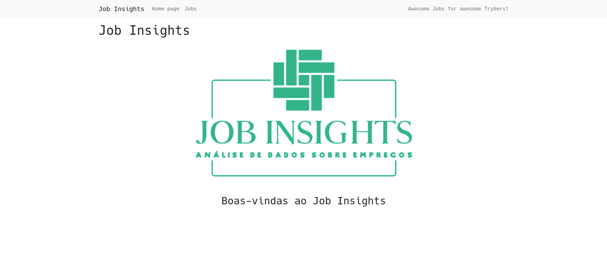

# Job Insights



# Sobre o Projeto
Este projeto é uma plataforma de empregos, construída  através de uma análise de dados com a linguagem Python.

Nesta plataforma é possível filtrar empregos e visualizar detalhes de um emprego. 

## Ferramentas utilizadas

> Linguagens: `Python`

> Testes: `Pytest`

> Frameworks: `Flask`

> Linters: `Flake8`

## Para rodar o projeto localmente:

1 - **Clone o repositório**
```bash
git clone git@github.com:imgeff/job-insights.git
```

## Executando aplicação
### Requisitos
- [Docker](https://docs.docker.com/compose/install/compose-desktop/)

Para rodar a aplicação:

 - Abra um terminal na raiz do projeto
 - Execute o comando `docker-compose up`
 - Abra o navegador no endereço -> http://172.25.0.2:5000/


